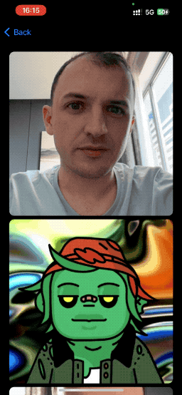

# SwiftUIRtc

<p align="center">
    
    <br/>
    <a href="https://agoraio-community.github.io/SwiftUIRtc/"></a>
    
</p>


SwiftUIRtc is a package for building video call apps using the Agora RTC SDK and SwiftUI. It provides a set of SwiftUI views and classes that simplify setting up and managing Agora RTC sessions for video calls.

This is not an official product of Agora, it is simply an open source project for helping developers use the RTC engine is new ways, such as with SwiftUI. If you have any issues with the classes in this repository, please open an issue or a PR. Agora's support team will likely not know about this package.

<p align="center">
    
</p>

See the [SwiftUIRtc Documentation](https://agoraio-community.github.io/SwiftUIRtc/).


## Requirements

- iOS 14.0+
- Swift 5.7+
- [AgoraRtcKit Account](https://console.agora.io)

## Installation

SwiftUIRtc can be installed using Swift Package Manager in Xcode. Simply add the package to your project by navigating to File > Swift Packages > Add Package Dependency and entering the repository URL:

```text
https://github.com/AgoraIO-Community/SwiftUIRtc.git
```

## Usage

To use SwiftUIRtc in your SwiftUI project, simply import the package and use the provided views and classes. For example, you can use `AgoraVideoCanvasView` and `AgoraManager` view to render all the video streams in an Agora RTC session:

```swift
import SwiftUIRtc
import AgoraRtcKit

struct AgoraGettingStartedView: View {
    @ObservedObject var agoraManager = AgoraManager(appId: <#AppId#>, role: .broadcaster)
    var channelId: String = "test"
    var body: some View {
        ScrollView {
            VStack {
                ForEach(Array(agoraManager.allUsers), id: \.self) { uid in
                    AgoraVideoCanvasView(manager: agoraManager, canvasId: .userId(uid))
                        .aspectRatio(contentMode: .fit).cornerRadius(10)
                }
            }.padding(20)
        }.onAppear {
            agoraManager.agoraEngine.joinChannel(
                byToken: <#Agora Temp Token#>, channelId: channelId, info: nil, uid: 0
            )
        }.onDisappear {
            agoraManager.agoraEngine.leaveChannel()
        }
    }
}
```

## Contributing

Contributions to SwiftUIRtc are welcome! If you encounter any issues or have feature requests, please submit an issue on the GitHub repository. Pull requests are also welcome.

## License

SwiftUIRtc is available under the MIT license. See the [LICENSE](LICENSE) file for more information.

## Acknowledgments

SwiftUIRtc relies on the [AgoraRtcKit](https://github.com/AgoraIO/AgoraRtcEngine_iOS) framework developed by Agora.io for real-time communication functionality.
